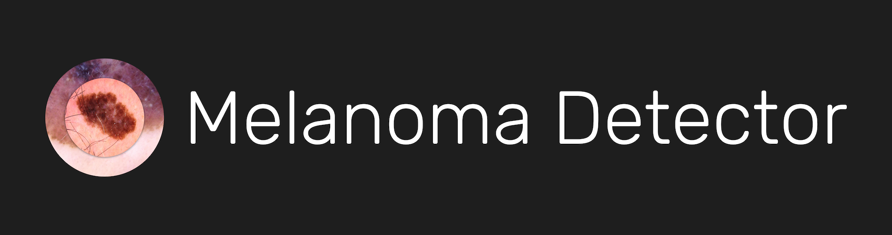
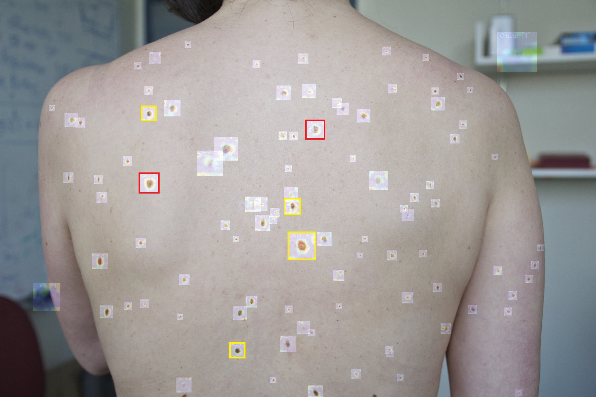
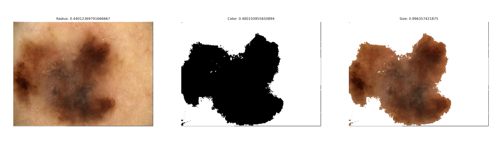
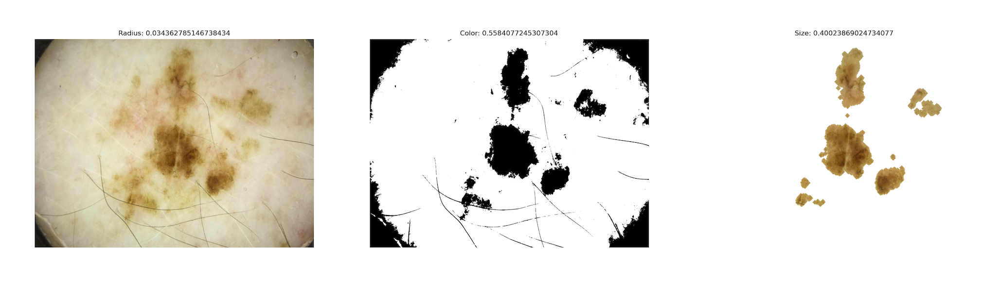
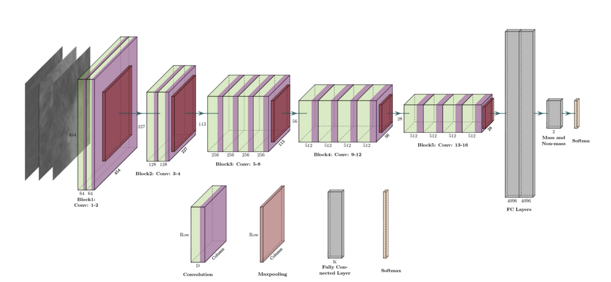
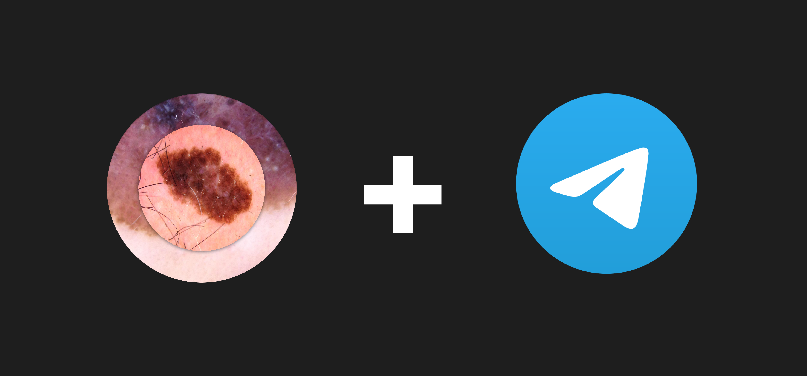

### Abstract
In our world, skin cancer is taking the lives of nearly 60 000 people each year. Even for professional dermatologists 
with the years of experience it is difficult to distinguish a benign nevus from a malignant melanoma.
In the past years, melanoma detection and classification were nearly solved by the use of machine learning. 
However, there is still an opportunity to further advance and improvement. 
In this project, I am trying to find the best approach to detect skin cancer. I have already compared machine learning 
models, graph algorithms, and neural networks of different architectures. The research produced unexpected outcomes: 
our standard symptoms of cancerous lesion, such as size, color, or shape are not sufficient to make 
an accurate diagnosis. Neural networks "see" something that is outside our understanding, and to finally solve the 
problem of skin cancer detection we need to understand underlying reasons of decisions that are produced by neural networks.

|  | 
|:-----------------------------------------------:|
|     *Real-time lesion detection (MIT 2021)*     |

### Part 1. Dataset and Preprocessing
The training data was taken from the [ISIC 2020 dataset](https://challenge2020.isic-archive.com/).

It consists of **33 000** skin lesion images. Every image is labeled as benign or malignant and vary in size. To use these images as an input to a neural network I resized them to be 512 x 512 pixels and transformed 
into numpy array.

The main focus of this project is to showcase the potential of different approaches in skin cancer detection, 
so I decided to begin with the approach used by dermatologists - ABCDE's. 

A, B, C, D, and E are the first letters of the symptoms that are usually used by dermatologists to distinguish 
benign and malignant lesions. The picture below briefly describes them.

My algorithmic approach is based on the 3 of them:
- Asymmetry
- Color
- Diameter

You can find the realization of computing these feature in [Preprocessing.py](Preprocessing.py).

In the pictures below you can see the stages of image preprocessing and corresponding 
Asymmetry(Radius), Color, and Diameter(Size) metrics scaled between 0 and 1. 

In my realization, preprocessing is divided into 3 stages. 

After the first stage image is resized and centered. In the second stage the program computes the image's
mask by thresholding, erosion, and closing. In the final stage, program runs graph algorithm to delete the 
mask's vignette and reassign colors to the lesion. Preprocessing takes about 1.5 seconds per image, which is far from good
if we want to detect melanoma in real-time.

You can download preprocessed coefficients and models for the training set from
[my Google Drive](https://drive.google.com/drive/folders/1yLW2JbOVb5qF2q4wlIrpmailRMl-2NkW?usp=sharing).

### Part 2. Deep Learning

Every approach below was evaluated by
[SIIM-ISIC competition](https://www.kaggle.com/competitions/siim-isic-melanoma-classification) test set on Kaggle.

#### Algorithmic Approach
First, I tried predicting melanoma by the coefficients computed in the preprocessing stage. It took about 1.8 second to
process each image. The resulting accuracy(52%) was a little better than flipping a coin, so I decided to use Neural Networks instead.

#### Dense Neural Network
To begin with, I tested the naive dense approach: recolor every pixel to grayscale and connect to the dense layer.
Then, create 1 or 2 dense layers with relu activation and an output layer with sigmoid activation. The increase 
in accuracy was gradual. After a 10-hour training, my model achieved 71% validation accuracy. However, then the model
started overfitting. In addition, the training was too complex and time-consuming, thus 71% - is a good estimate of what 
simple neural networks are capable of.

|  |
|:-------------------------------------:|
|          *Dense NN Example*           |

#### Convolutional Neural Network
Dense NNs have shown significant accuracy improvement, but state-of-the-art solutions are based on convolutional 
neural networks.
To learn more about CNNs check out 
[an article](https://towardsdatascience.com/a-comprehensive-guide-to-convolutional-neural-networks-the-eli5-way-3bd2b1164a53)
at TowardsDataScience.

Convolutional neural network approach raised accuracy by 8% and decreased computational time by 30%.
However, to achieve desired accuracy, machine learning engineers use CNNs, which were trained beforehand on images from 
[ImageNet](https://www.image-net.org/index.php).

|  |
|:--------------------------------------:|
|       *Convolutional NN Example*       |

#### Pre-Trained CNN

From the variety of pre-trained models I have chosen EfficientNetV2L due to its accuracy and sequential structure. After 
training 2 dense layers as an extension to pre-trained model, I enabled training for the last 2 EfficientNet blocks. 
This fine-tunning gave my model 2% additional validation accuracy. The resulting accuracy reached 83%, which is way 
more accurate than professional dermatologist's diagnosis.

#### Hybrid CNN

Overall, I achieved good metrics and the next step was to combine different methods. I concatenated two models: 
algorithmic and pre-trained CNN. Validation accuracy increased by 1%, but computational time also raised extremely - by 4 times. Therefore,
it is not efficient to combine algorithmic and deep learning approaches in skin cancer detection.

#### Approach Comparison Table:

| Approach             | Running time (s) | Precision |
|----------------------|------------------|-----------|
| Algorithmic          | 1.80             | 52 %      |
| Dense Neural Network | 0.68             | 71 %      |
| Convolutional NN     | 0.48             | 79 %      | 
| Pre-trained CNN      | 0.54             | 83 %      | 
| Hybrid CNN           | 2.30             | 84 %      | 

### Part 3. Telegram Bot

To benefit the people all around the globe, I decided to deploy my neural network as a telegram bot for public use. You 
can find the corresponding code in [Melanoma-Bot.py](Melanoma-Bot.py). Feel free to make suggestions and pull requests.
The usage of the bot is pretty straightforward:
1) Start the bot.
2) Send an image or a file of a skin lesion.
3) Get the diagnosis: ok or might be cancerous.

### Appendix: Quick Start
1) Download ISIC 2020 dataset.
2) Specify the path to the dataset in [Data-Transformer.py](Data-Transformer.py).
3) Run [Data-Transformer.py](Data-Transformer.py).
4) Copy paths of the data.npy and labels.npy which you will get after [Data-Transformer.py](Data-Transformer.py) executes
to one of the files with -Model postfix.
5) Train the model.
6) Check its accuracy on the [ISIC Kaggle Competition](https://www.kaggle.com/competitions/siim-isic-melanoma-classification)
7) Use the model in your research, project, or just for fun!

<h2 align="center">Project Timeline</h2>

- [x] Project structure development (August 2022)
- [x] Data formatting and preprocessing (September 2022)
- [x] Deep learning models and bot blueprint (October 2022)
- [x] Melanoma-Detector bot release (January 2023)
- [ ] Real-Time melanoma detection (February 2023)
- [ ] API and additional deep learning models (March 2023)
- [ ] Final readme and summing up (April 2023)