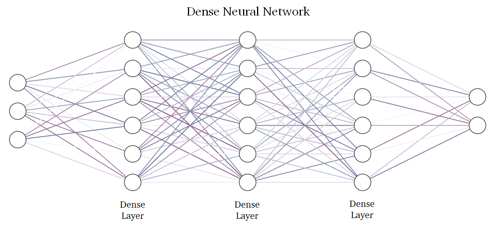

### Abstract
In our world, skin cancer is taking the lives of nearly 60 000 people each year. Even for professional dermatologists 
with years of experience it is difficult to distinguish a benign nevus from a malignant melanoma.
In the past years melanoma detection and classification were nearly solved by the use of machine learning. 
However, there is still an opportunity to further advance and improvement. 
In this project I am trying to find the best approach to detect skin cancer. I have already compared machine learning 
models, graph algorithms, and neural networks of different architecture. The research produced unexpected outcomes: 
our standard symptoms of cancerous lesion, such as size, color, or shape are not sufficient to make 
an accurate diagnosis. Neural networks "see" something that is outside our understanding, and to finally close the 
problem of skin cancer detection we need to understand underlying reasons of decisions produced by neural networks.

|  | 
|:-----------------------------------------------:| 
|    *Real-time melanoma detection (MIT 2021)*    |

### Part 1. Dataset and Preprocessing
The training data was taken from the [ISIC 2020 dataset](https://challenge2020.isic-archive.com/).

It consists of 33 000 skin lesion images. Every image is labeled as benign or malignant and can be of any size.

To use these images as an input to a neural network I resized them to be 512 x 512 pixels and transformed 
into numpy array.

The main focus of this project is to showcase the potential of different approaches in skin cancer detection, 
so I decided to begin with the method used by dermatologists - ABCDE's. 

A, B, C, D, and E are the first letters of the symptoms that are usually used by dermatologists to distinguish 
benign and malignant lesions. The picture below briefly describes them.

My algorithmic approach is base on the 3 of them:
- Asymmetry
- Color
- Diameter

You can find the realization of these metrics in [Preprocessing.py](Preprocessing.py).

In the pictures below you can see the stages of image preprocessing and corresponding 
Asymmetry(Radius), Color, and Diameter(Size) metrics. 

|  |
|:--------------------------------------:|
|  |

After the first stage image is resized and centered. In the second stage the program computes the image's
mask by thresholding, erosion, and closing. In the final stage program runs graph algorithm to delete the 
mask's vignette and reassign colors to the lesion. Preprocessing takes about 1.5 seconds per image, which is not good
if we want to detect melanoma in real-time.

### Part 2. Deep Learning (description will be available soon)

Results:

| Approach             | Running time (s) | Precision |
|----------------------|------------------|-----------|
| Algorithmic          | 1.80             | 52 %      |
| Dense Neural Network | 0.68             | 71 %      |
| Convolutional NN     | 0.48             | 79 %      | 
| Pre-trained CNN      | 0.54             | 83 %      | 
| Hybrid CNN           | 2.30             | 84 %      | 

### Part 3. Telegram Bot

To benefit the people from all around the world, I decided to deploy my neural network as a telegram bot for public use. 
I developed a bot blueprint, and now it is in the last testing stage. You can find the corresponding code in 
[Melanoma-Bot.py](Melanoma-Bot.py). Feel free to make suggestions and pull requests. The bot will be available in 
the first quarter 2023.

<h2 align="center">Project Timeline</h2>

- [x] Project structure development (August 2022)
- [x] Data formatting and preprocessing (September 2022)
- [x] Deep learning models and bot blueprint (October 2022)
- [ ] Melanoma-Detector bot release (January 2023)
- [ ] Real-Time melanoma detection (February 2023)
- [ ] API and additional deep learning models (March 2023)
- [ ] Final readme and summing up (April 2023)