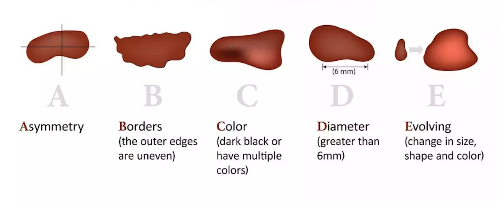

### Abstract
In this project I am trying to find the best approach to detect skin cancer. In the past years melanoma detection and classification were nearly solved. However, there is still an opportunity to further advance and improvement. I have compared machine learning models, graph algorithms, and neural networks of different architecture. The research produced unexpected outcomes: our standard symptoms of cancerous lesion, such as size, color, or shape are not sufficient to make an accurate diagnosis. Neural networks "see" something outside our understanding, and to finally close the problem of skin cancer detection we need to understand on what their decisions are based.     

### Introduction
|  | 
|:-----------------------------------------------:| 
|    *Real-time melanoma detection (MIT 2021)*    |

### Part 1. Dataset and Preprocessing
The training data was taken from the ISIC 2020 dataset. It consists of 33 000 skin lesion images. Every image is labeled as benign or malignant.

The training data was taken from the ISIC 2020 dataset. It consists of 33 000 skin lesion images. Every image is labeled as benign or malignant.

### Part 2. Deep Learning
Sample Text Sample Text Sample Text Sample Text Sample Text Sample Text Sample Text Sample Text Sample Text Sample Text Sample Text Sample Text Sample Text Sample Text Sample Text Sample Text Sample Text

Results:

| Approach             | Running time (s) | Precision |
|----------------------|------------------|-----------|
| Algorithmic          | 1.80             | 52 %      |
| Dense Neural Network | 0.68             | 71 %      |
| Convolutional NN     | 0.48             | 79 %      | 
| Pre-trained CNN      | 0.54             | 83 %      | 
| Hybrid CNN           | 2.30             | 84 %      | 

### Part 3. Telegram Bot

<h2 align="center">To Be Developed</h2>
1) Real-Time Detection
   - From video file
   - From camera
   

2) API
   - Preprocessing service
   - Classification API

3) Further Experiments
   - ResNet
   - ConvNeXtXLarge
   - PyTorch Implementation
   - Sklearn ML models